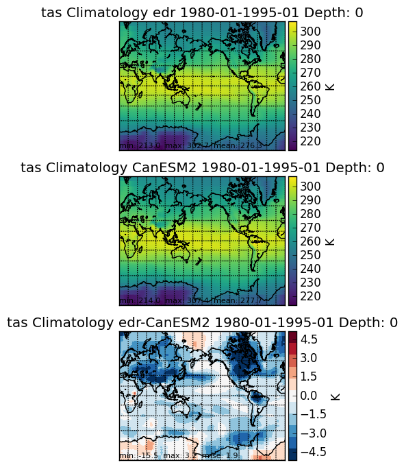

.. _mercator:

Mercator Projection
===================

For this example we want to make a color map comparison between
the edr run ID and CanESM2 for the atmospheric surface temperature
climatology between 1980 and 1995.

First use the command:

.. code-block:: bash

    validate-configure

Then edit the conf.yaml file to the following:

.. code-block:: yaml

    run: 'edr'
    experiment: 'historical'

    defaults:
                climatology_dates:
                  start_date: '1980-01'
                  end_date: '1995-01'
                png: True

    plots:    
            - variable: 'tas'
              plot_projection: 'mercator'
              data_type: 'climatology'
              compare_climatology: True
              comp_models: 
                - CanESM2

    delete:
              del_netcdf: False
              del_mask: True
              del_ncstore: True
              del_cmipfiles: False
    
    direct_data_root: '/raid/rc40/data/ncs/historical-edr'      
    observations_root: '/raid/rc40/data/ncs/obs4comp'
    cmip5_root: '/raid/ra40/CMIP5_OTHER_DOWNLOADS/'

Save the file and then use the command:

.. code-block:: bash

    validate-configure
