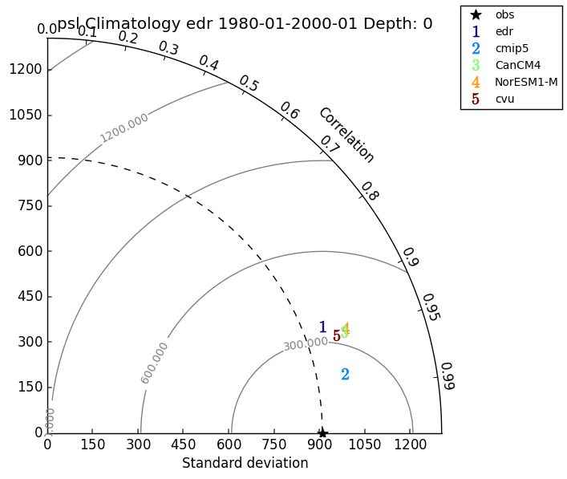

.. _taylor:

Taylor Diagram
===================

For this example we want to make a taylor diagram of the
atmospheric pressure at the surface for the climatology from
1980 to 2000.

First use the command:

.. code-block:: bash

    validate-configure
    
Then edit the conf.yaml file to the following:

.. code-block:: yaml

    run: 'edr'
    experiment: 'historical'

    defaults:
                compare_climatology: True
                climatology_dates:
                  start_date: '1980-01'
                  end_date: '2000-01'
                png: True

    plots:
            - variable: 'psl'
              plot_projection: 'taylor'
              compare:
                  cmip5: True
                  model: True
                  obs: True
                  runid: True
              comp_models:
                - CanCM4
                - NorESM1-M
              comp_ids:
                - cvu

    delete:
              del_fldmeanfiles: True
              del_mask: True
              del_ncstore: True
              del_remapfiles: True
              del_trendfiles: True
              del_zonalfiles: True
              del_ENS_MEAN_cmipfiles: True
              del_ENS_STD_cmipfiles: True
              del_cmipfiles: False

    observations_root: '/raid/rc40/data/ncs/obs4comp'
    cmip5_root: '/raid/ra40/CMIP5_OTHER_DOWNLOADS/'

Save the file and then use the command:

.. code-block:: bash

    validate-configure
