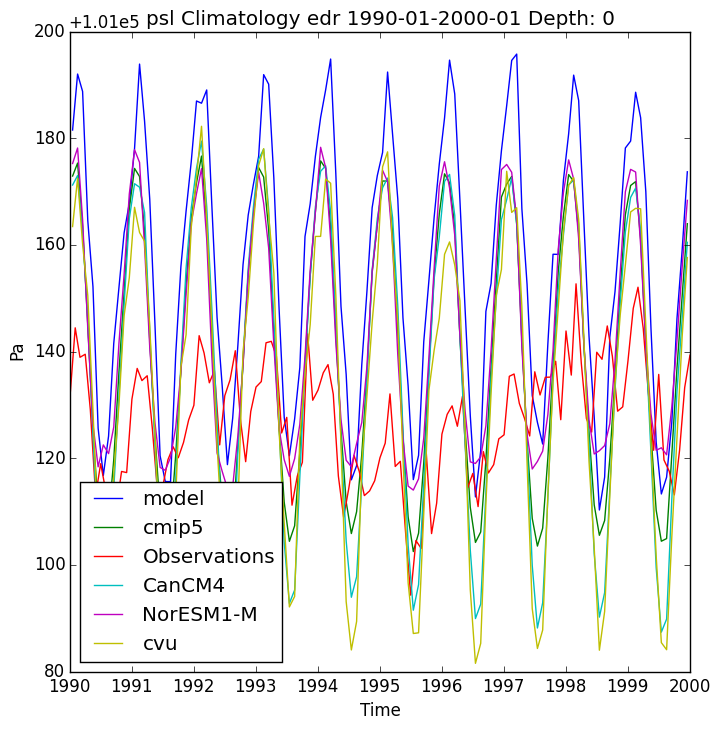

.. _timseries:

Time Series Plot
===================

For this example we want to make a time series plot of the
atmospheric pressure at the surface for the climatology from
1980 to 2000.

First use the command:

.. code-block:: bash

    validate-configure

Then edit the conf.yaml file to the following:

.. code-block:: yaml

    run: 'edr'
    experiment: 'historical'

    defaults:
                climatology_dates:
                  start_date: '1990-01'
                  end_date: '2000-01'
                png: True

    plots:
            - variable: 'psl'
              plot_projection: 'time_series'
              comp_obs:
                - 20CR
              comp_cmips: 'all'
              comp_ids:
                - cvu

    delete:
              del_netcdf: False
              del_mask: True
              del_ncstore: True
              del_cmipfiles: False
    
    direct_data_root: '/raid/rc40/data/ncs/historical-edr/'
    observations_root: '/raid/rc40/data/ncs/obs4comp'
    cmip5_root: '/raid/ra40/CMIP5_OTHER_DOWNLOADS/'

Save the file and then use the command:

.. code-block:: bash

    validate-configure
